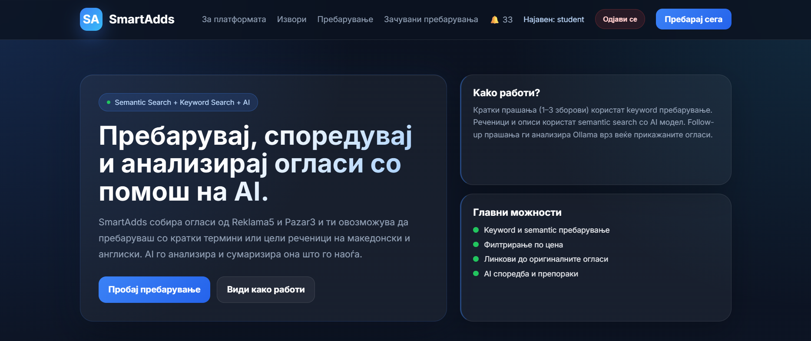
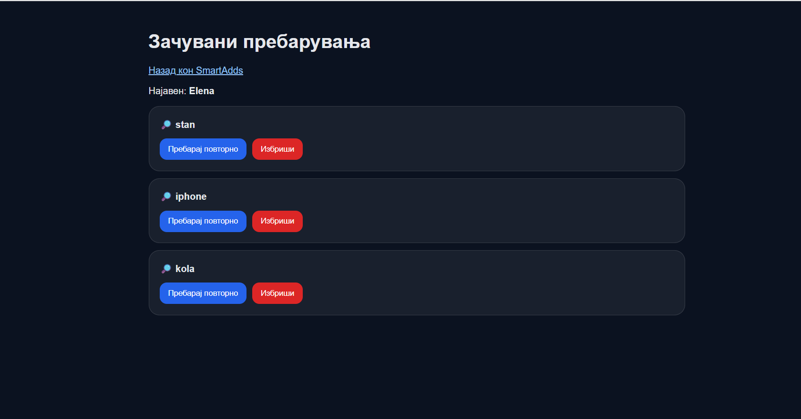
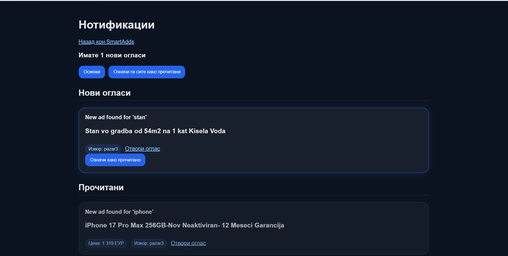
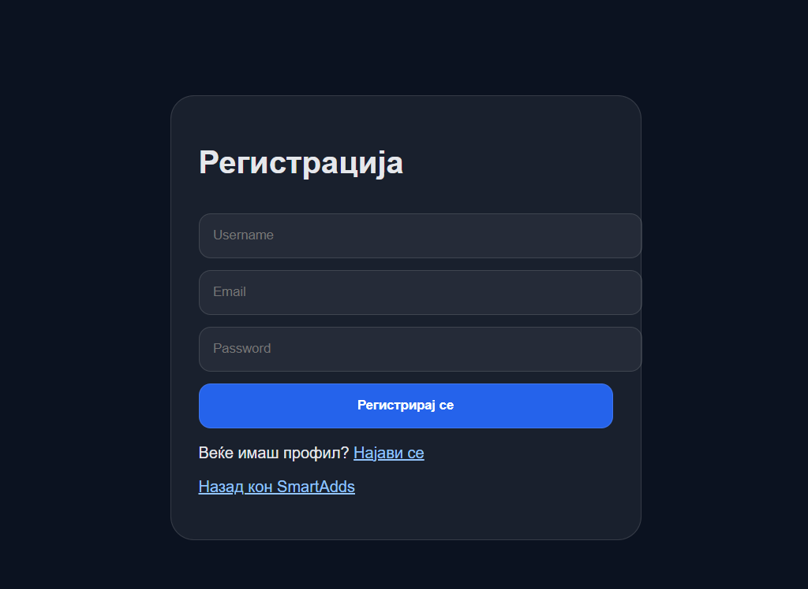
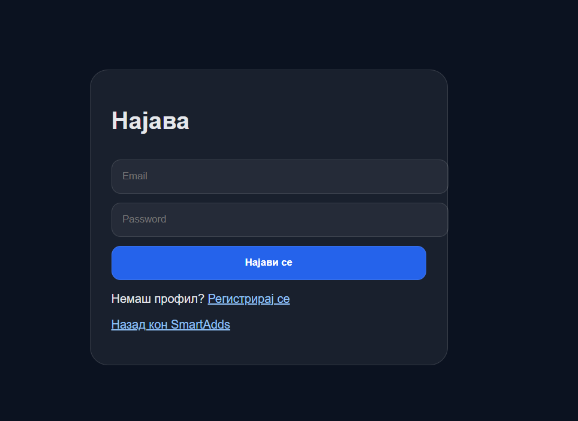

# SmartAdds

SmartAdds е веб апликација за интелигентно пребарување огласи од Pazar3 и Reklama5.

Системот автоматски ги собира огласите преку scraper, ги зачувува во SQLite база и овозможува пребарување преку AI асистент базиран на Ollama.

Дополнително, корисниците можат да:

- Креираат профил
- Се најавуваат во системот
- Зачувуваат пребарувања
- Добиваат нотификации за нови огласи кои одговараат на нивните пребарувања
- Користат AI chat за пребарување и анализа на огласи

---

## Технологии

- Python 3.10+
- FastAPI
- SQLite
- SQLAlchemy
- BeautifulSoup
- APScheduler
- Ollama
- Sentence Transformers
- MCP (Model Context Protocol)
- SMTP (Email Notifications)

---

## Барања

Пред стартување потребно е да имате инсталирано:

- Python 3.10+
- Git
- Ollama

Проверка:

```
python --version
git --version
ollama --version
```

---

## Инсталација

### 1. Клонирај го проектот

```bash
git clone https://github.com/ViktorijaSerafimovska/SmartAdds.git
cd SmartAdds
```

### 2. Креирај virtual environment

**Windows:**

```bash
python -m venv .venv
.venv\Scripts\activate
```

**Mac / Linux:**

```bash
python3 -m venv .venv
source .venv/bin/activate
```

### 3. Инсталирај ги зависностите

```bash
pip install -r requirements.txt
```

### 4. Конфигурирај Ollama

Преземи го моделот (само еднаш):

```bash
ollama pull llama3.1
```
### 5.Конфигурирај .env

Копирај го `.env.example` во `.env`:

```bash
cp .env.example .env
```

Отвори го `.env` и постави го `OLLAMA_HOST`:

- Ако Ollama работи на истата машина (Linux / Mac): остави го стандардно (`127.0.0.1`)
  - Ако користиш WSL на Windows: постави го на WSL gateway IP-то. Добиј го со:
    ```bash
    cat /etc/resolv.conf | grep nameserver
    ```
  Потоа во `.env`:

    ```
    OLLAMA_HOST=172.31.x.x
     ```
  За email известувања додади во `.env`:

    ```env
    SMTP_HOST=smtp.gmail.com
    SMTP_PORT=587
    SMTP_USER=your_email@gmail.com
    SMTP_PASSWORD=your_google_app_password
    SMTP_FROM=SmartAdds Notifications <your_email@gmail.com>
    ```

  Потребно е:

  - Google 2-Step Verification
  - Google App Password  

## База на податоци

Апликацијата користи SQLite база:

```
ads.db
```

Табелите автоматски се креираат при стартување на апликацијата.

## Собирање огласи

```bash
python -m app.crawler.run_scraper
```

Ова ќе ги преземе огласите од:

- Pazar3
- Reklama5

и ќе ги зачува во SQLite базата.

## Стартувај го серверот

```bash
uvicorn app.main:app --reload
```

или

```bash
python -m uvicorn app.main:app --reload
```

> **Прво стартување:** серверот ќе изгради semantic search индекс за сите огласи. Ова трае ~2 минути. Следните
> стартувања се моментални (индексот е кеширан).

## Отвори во browser

```
http://127.0.0.1:8000
```

Swagger документација:

```
http://127.0.0.1:8000/docs
```

---

## Автоматско освежување на огласи

Системот користи APScheduler.

По стартување автоматски се активира scheduler кој:

- Скрејпа нови огласи
- Ги зачувува во база
- Проверува Saved Searches
- Генерира Notifications

Интервалот се конфигурира во:

```
app/main.py
```

пример:

```
scheduler.add_job(
    scrape_all,
    "interval",
    hours=1
)
```

---

## Кориснички функционалности

### Регистрација

Корисникот може да креира профил преку:

```
/register
```

или преку веб интерфејсот.

---

### Најава

Корисникот може да се најави преку:

```
/login
```

или преку веб интерфејсот.

---

### Saved Searches

Корисникот може да зачува пребарување.

Пример:

- iphone
- golf 7
- stan vo skopje

Системот ги користи овие пребарувања за автоматско следење на нови огласи.

---

### Notifications

Кога ќе се појави нов оглас кој одговара на зачувано пребарување:

- Се креира notification
- Се зачувува во база
- Се прикажува во Notification Center
- Се испраќа email известување до корисникот

---

### Email Notifications

SmartAdds поддржува автоматски email известувања.

Кога ќе се пронајде нов оглас кој одговара на зачувано пребарување:

- Корисникот добива email
- Email-от содржи:
  - Име на пребарувањето
  - Наслов на огласот
  - Линк до огласот

Email известувањата се испраќаат преку Gmail SMTP сервер.

### MCP Integration

SmartAdds користи MCP сервер за комуникација помеѓу AI асистентот и пребарувачкиот систем.

Поддржани MCP операции:

- initialize
- tools/list
- tools/call

Моментално е имплементирана алатката:

```
search_ads
```

која овозможува пребарување низ локално зачуваните огласи.

---

### AI Chat

AI асистентот користи:

- Ollama
- Llama 3.1

за:

- пребарување огласи
- анализа на резултати
- сумирање на информации

---

## Screenshots

### Почетна страна



### Зачувани пребарувања



### Нотификации




### Register



### Login



---

## Автори

SmartAdds Project

- Елена Цикарска
- Викторија Серафимовска
- Ана Чачарска
- Михаела Трајковска
 
Faculty of Computer Science & Engineering (FCSE)